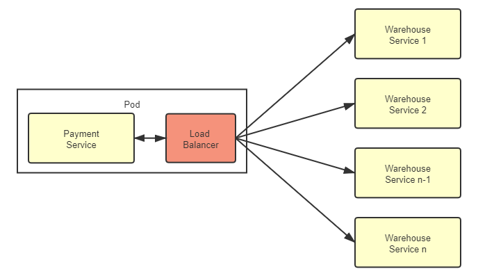
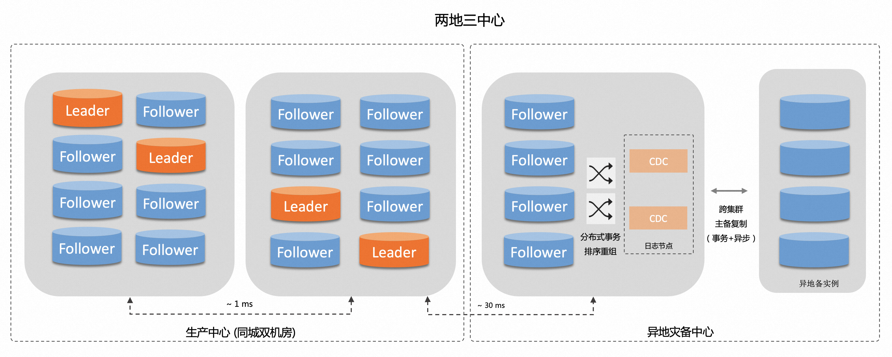
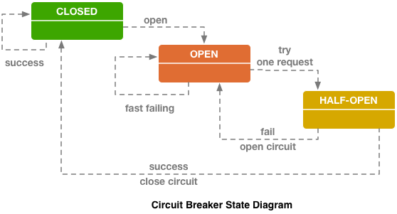

# 架构师视角

## 远程服务的访问
### 远程调用
调用外部服务的故障大致可以分为“失败”（如 400 Bad Request、500 Internal Server Error 等错误）、“拒绝”（如 401 Unauthorized、403 Forbidden 等错误）以及“超时”（如 408 Request Timeout、504 Gateway Timeout 等错误）三大类，其中“超时”引起的故障尤其容易给调用者带来全局性的风险。这是由于目前主流的网络访问大多是基于 TPR 并发模型（Thread per Request）来实现的，只要请求一直不结束（无论是以成功结束还是以失败结束），就要一直占用着某个线程不能释放。而线程是典型的整个系统的全局性资源，尤其是 Java 这类将线程映射为操作系统内核线程来实现的语言环境中，为了不让某一个远程服务的局部失败演变成全局性的影响，就必须设置某种止损方案
### Rest 设计风格

## 事务处理

### 本地事务

### 全局事务

### 共享事务

### 分布式事务

## 多级分流系统

# 分布式的基石

## 共识算法


## 6.2 从类库到服务

服务化的目标，是把系统拆分为可以**独立自治**的组件；而类库/模块化更多是**代码层面的复用与拆分**。

两者的关键差异在于：

- **类库调用发生在进程内**：接口调用通过编译期静态链接与运行期地址引用完成，因此 
本质上是一次本地函数调用，不涉及网络传输。但 类库升级需要重新编译并发布应用整体。
- **服务调用跨进程/跨主机**：接口调用需要序列化与网络传输，必须面对延迟、失败、重试、超时等分布式问题。但服务可以独立升级与发布，调用方与被调用方 通过契约（接口/协议）进行解耦。

**服务化需要解决的三类基础问题**

当系统走向服务化，最先要补齐的是三类基础能力：**服务发现、网关路由、负载均衡**。

- **服务发现**：调用方如何获知“被调用服务在哪里”。
- **网关/路由**：请求如何抵达正确的服务实例，以及如何做统一入口治理（鉴权、限流、灰度等）。
- **负载均衡**：当存在多个等价实例时，如何在它们之间分摊请求。

### 6.2.1 服务发现

####  标识方式

一个服务实例通常由 **主机标识（域名/IP）+ 端口** 唯一确定。

服务发现是 将一个服务业务员名称映射为一组可用的实例地址列表的过程。

最简单的服务发现方式是 **DNS**：将域名解析为 IP（并可能返回多个地址），客户端再结合端口完成访问。

当系统需要支持**实例上下线、故障切换、扩缩容、重启**等动态变化时，通常需要更强的注册与发现机制，让调用方能够及时感知实例变化。


#### 服务发现的三个核心过程

**1. 服务注册（Service Registration）**
服务启动时将自身坐标信息通知注册中心，分两种模式：
- 自注册模式：应用程序自己完成，如 Spring Cloud 的 `@EnableEurekaClient`
- 第三方注册模式：由容器编排框架完成，如 Kubernetes、Registrator

**2. 服务维护（Service Maintaining）**
由于服务可能因宕机、断网等原因突然失联（无法保证优雅下线），框架需主动维护服务列表的正确性。通常支持多种协议（HTTP/TCP）和方式（心跳、探针、长连接等）监控服务健康状态，自动剔除不健康节点。

**3. 服务发现（Service Discovery）**
消费者将符号（ServiceID、服务名、FQDN）转换为服务实际坐标的过程，实现方式包括 HTTP API、DNS Lookup、环境变量注入等。

---

#### 可用性 vs 一致性（CAP 困境）

注册中心在系统中地位特殊——**被所有服务依赖但不依赖任何服务**，一旦崩溃整个系统瘫痪，因此生产环境通常以 3~7 个节点集群部署。


- **可用（Availability）**：注册中心本身功能是否可用、能否持续对外提供查询与注册能力。
- **可靠（Reliability）**：注册的服务数据是否准确、一致，能否避免“脏数据”导致的错误路由。

常见保障手段：
- **高可用**：多副本部署、故障转移。
- **可靠性**：通过一致性协议（如 Paxos/Raft）保证数据一致。

> 注：在注册中心的可用性与可靠性之间做权衡时，通常倾向于保证“可用性”，即允许短暂的数据不一致（“脏读”），以确保服务发现功能不中断。

| | **Eureka（AP）** | **Consul（CP）** |
|---|---|---|
| 优先保证 | 高可用性 | 高可靠性（数据一致） |
| 同步方式 | 异步复制，有延迟 | Raft 算法，多数派写入成功才算完成 |
| 跨数据中心 | 较弱 | Gossip 协议支持多数据中心 |
| 容错依赖 | 有 Ribbon + Hystrix 兜底 | 无其他组件兜底，故优先一致 |
| 缓存机制 | 客户端缓存 + TTL，注册中心崩溃仍可最低限度可用 | — |

---


如何选择 AP 还是 CP？

关键问题：**网络分区后，各分区只能看到自己区内的服务，对你的系统影响有多大？**

- **影响不大甚至有益** → 选 AP（如多机房场景，分区反而优化了调用链路）
- **影响极大，可能引发数据错误** → 选 CP（如强依赖集中式缓存、消息总线等有状态服务，数据错乱比停机更糟）


#### 注册中心的常见实现

1. 基于分布式 K/V 存储或协调系统构建，例如 `ZooKeeper`。
2. 专用的服务发现/注册中心产品或组件，例如 `Eureka`、`Consul`、`Nacos`。
3. 基于基础设施能力实现，例如 `DNS`（更轻量，但动态能力相对有限）。


#### 服务发现与网关路由的关系

- **服务发现**解决的是“具体服务实例在哪里”的问题：根据服务名动态获取一组可用实例地址（IP + 端口）。
- **网关路由**解决的是“请求怎么走”的问题：把外部请求转发到正确的内部服务与实例。

两者是**互补关系**：网关是流量入口，服务发现为网关提供“目标实例列表”的动态数据来源。

##### 1）服务发现与网关路由的协作流程

```text
外部请求
   │
   ▼
[API Gateway]
   │  1. 解析路由规则（/api/order/** → order-service）
   │  2. 向注册中心查询 order-service 的实例列表
   ▼
[注册中心] ←── 服务实例定期心跳注册
(Eureka/Consul/Nacos)
   │  3. 返回可用实例列表 [192.168.1.10:8080, 192.168.1.11:8080]
   ▼
[API Gateway]
   │  4. 负载均衡选择一个实例
   ▼
[目标服务实例]
```


模式一：网关集成服务发现（集成式）

网关自身集成注册中心客户端，直接订阅/拉取服务列表，在本地维护路由表，并在转发时完成负载均衡选择。

```yaml
# Spring Cloud Gateway 示例
spring:
  cloud:
    gateway:
      routes:
        - id: order-service
          uri: lb://order-service   # lb:// 触发服务发现 + 负载均衡
          predicates:
            - Path=/api/orders/**
```

- **优点**：实例变化可快速感知，路径更短，延迟低。
- **缺点**：网关与注册中心强耦合；网关需要具备更多状态与复杂度。

 模式二：网关与服务发现解耦（解耦式）

网关只负责路由规则与治理，服务发现与负载均衡交由独立组件/平台层承担（例如云负载均衡、Nginx + Consul Template 等）。

```text
外部请求 → Gateway（路由规则） → LB（服务发现/负载均衡） → 服务实例
```

- **优点**：职责更清晰，网关更容易做无状态扩展。
- **适用**：云原生/K8s 环境中常见（服务发现由平台能力内化）。


##### 关键协作细节

| 环节 | 说明 |
|------|------|
| **路由匹配** | 网关按 path/header/method 等规则确定目标服务名 |
| **实例获取** | 从注册中心/平台层获取服务名对应的健康实例列表 |
| **负载均衡** | 轮询/随机/权重/一致性哈希等策略选择具体实例 |
| **健康剔除** | 注册中心或平台层实时剔除不健康实例，网关路由随之更新 |
| **熔断降级** | 网关可结合服务发现状态做熔断/降级（如 Sentinel/Resilience4j） |


服务发现是网关路由的**动态数据来源**，网关是服务发现能力的**流量消费者**。两者协作的本质是：

> **路由规则（相对静态） + 服务实例（动态发现） = 实际转发目标**

### 6.2.2 网关路由

#### 网关的职责

网关（Gateway）的核心价值，是作为系统对外的**统一入口**：外部请求先到达网关，网关再依据既定规则将流量转发到内部集群中**正确的服务实例**。因此它也常被称为**服务网关**或 **API 网关**。

从能力拆分的角度看，网关通常由两类职能构成：

- **路由（Router，基础能力）**：把请求“转发到哪里、以什么方式转发”。
- **过滤/治理（Filter，增强能力）**：在转发前后做统一处理，例如鉴权、限流、熔断、灰度、日志、指标、协议转换等。

其中，路由能力的设计通常需要优先回答三个问题：**协议层次、性能、可用性**。

##### 1）协议层次：四层网关 vs 七层网关

网关工作在不同协议层，决定了它能理解请求到什么程度，也决定了转发成本与可扩展性。

1. **四层网关（L4）**：面向 TCP/UDP 等传输层协议做转发（常见做法是基于连接/端口的转发）。
   - **适用**：后端服务对上层协议不敏感或无需做应用层治理。
   - **特点**：转发开销小、性能强，但难以做丰富的应用层策略。
2. **七层网关（L7）**：面向 HTTP/HTTPS/gRPC 等应用层协议做代理与转发。
   - **适用**：需要基于 URL/Header/Cookie/方法等请求特征做路由与治理。
   - **特点**：能力更强但成本更高，需要处理解析、编解码、连接复用等问题。

##### 2）性能：转发模型与实现策略

网关性能主要受两类因素影响：

- **工作模式**：L4 转发还是 L7 代理（后者需要解析与处理应用层语义，CPU 与内存成本更高）。
- **实现策略**：连接管理、线程模型、I/O 模型、缓存与零拷贝等。

在以 HTTP 为主的互联网服务场景中，通常需要使用 **L7 代理网关** 来承载丰富的路由与治理能力；因此，进一步影响性能上限的关键，就落在**网络 I/O 模型**与并发模型设计上（见后文 `1.2 网络 IO 模型`）。

##### 3）可用性：轻量、成熟、可扩展

- **保持轻量**：把复杂业务逻辑下沉到后端服务，网关尽量专注在“路由 + 治理”，避免成为新的单点瓶颈。
- **优先成熟方案**：选型尽量选择经过大规模验证的产品与实现，降低故障概率与运维成本。
- **分层承载流量入口**：在生产环境中常在网关前增加一层更健壮的入口设施（如硬件/云负载均衡、等价路由器），承担四层接入与流量分发；网关本身再通过**横向扩展**提升整体吞吐与可用性。

#### 网络 IO 模型

网关在七层代理模式下，本质上是一个高并发的网络程序：它需要在**有限线程/连接资源**下，尽可能高效地处理大量短连接或长连接请求。因此，网关的性能上限很大程度取决于所采用的网络 I/O 模型。

从语义上看，I/O 模型的差异主要体现在两点：

- **等待数据就绪（ready）时是否阻塞**：没有数据可读/不可写时，线程要不要挂起。
- **数据搬运（copy）由谁完成**：是内核把数据拷贝到用户缓冲区后再唤醒应用，还是应用自己发起异步回调/通知。

##### 1）异步 I/O（Asynchronous I/O，AIO）

应用提交 I/O 请求后**立即返回**，不需要阻塞等待；当内核完成数据读取并拷贝到用户态缓冲区后，再通过**回调/事件**通知应用继续处理。

- **优点**：线程占用少，适合高并发；理论上吞吐上限更高。
- **难点**：编程模型更复杂；不同平台/语言运行时对 AIO 的支持成熟度不一。
- **常见形态**：基于事件回调或 Future/Promise 的异步网络框架。

##### 2）同步 I/O（Synchronous I/O）

同步 I/O 的共同点是：应用线程在某个阶段需要等待 I/O 完成（至少会等待“数据就绪”或“拷贝完成”之一）。典型划分如下。

1. **阻塞 I/O（Blocking I/O）**
   - `read()` 没有数据时会阻塞线程，直到数据到达并完成拷贝。
   - **特点**：模型简单，但每连接/每请求容易占用一个线程，扩展性差。

2. **非阻塞 I/O（Non-blocking I/O）**
   - `read()` 立即返回，若无数据则返回 `EAGAIN`/`EWOULDBLOCK`，应用需要不断轮询重试。
   - **特点**：不会挂死线程，但轮询会浪费 CPU；通常不会单独使用。

3. **I/O 多路复用（I/O Multiplexing）**
   - 通过 `select/poll/epoll`（或同类机制）让一个线程同时监听多个连接的可读/可写事件；当事件就绪后再执行真正的 `read/write`。
   - **特点**：经典的高并发方案，性能与资源利用率均衡；绝大多数高性能网关/反向代理都基于此类模型。

4. **信号驱动 I/O（Signal-driven I/O）**
   - 内核通过信号通知某个 fd 已就绪，应用收到信号后再执行读写。
   - **特点**：工程实践较少，主要原因是信号处理复杂、可控性与可移植性一般。

> 经验上：
> - 简单服务可用阻塞 I/O 快速实现；
> - 要支撑高并发网关，常见路线是“多路复用 + 少量工作线程”的 Reactor 模型；
> - 若语言/运行时对异步生态成熟（如事件循环），可以用异步 I/O 进一步提升并发能力与资源利用率。


技术实现上，从路由器的角度，网关和负载均衡器没有本质区别；但从目的角度，负载均衡器是对实例流量的平均路由，网关是结合网络请求的特征，进行正确的路由。

#### 前端适配后端网关设计
网关不必为所有的前端提供无差别的服务，而是应该针对不同的前端，聚合不同的服务，提供不同的接口和网络访问协议支持。
不同的前端实现平台（Web程序、App客户端、 PC应用），通过网关适配，统一稳定一致的后端。

### 负载均衡
服务端负载均衡器，是集中式的、服务化的。
所有的网络请求都要经过这个负载均衡器，也就必然会多一次网络开销。
基于此，如果将负载均衡的逻辑放到客户端（接口调用方），可以避免这一开销，提升整体性能。

#### 客户端负载均衡器
负载均衡器与服务在同一个进程，解决了以上问题
但深度的耦合引入另外两个问题
1. 程序语言，负载均衡器的实现依赖服务程序语言
2. 稳定性方面相互影响。CPU、内存等资源是共用的

#### 代理负载均衡
负载均衡器独立一个进程，但设计上以边车的形式附属于服务进程。


以K8s 为例，sidecar 模式部署负载均衡器，负载均衡器调用时，设计在主机内部回环调用，无网络开销。

> 什么是 Sidecar 模式？
在服务网格（如 Istio）中，会在每个 Pod 中注入一个代理容器（如 Envoy）作为"边车"（Sidecar）。这个代理容器与业务容器同属一个 Pod，负责承担所有的流量管理、负载均衡、熔断、可观测性等基础设施职责，从而让业务容器专注于业务逻辑本身。


Pod 内容器的网络共享
Kubernetes 做出了一个严格的调度保证：
1. 同一个 Pod 中的所有容器，永远不会被调度到不同的节点上运行。
2. 同一 Pod 内的容器共享同一个 网络名称空间（Network Namespace）。
3. 因此，它们共享同一个 localhost，即同一块回环设备（Loopback，lo）。

分离带来的显著收益

尽管 Sidecar 模式引入了额外的一层代理转发，但这一层的代价极小（回环通信），而换来的收益却远超付出：
1. 语言无关性：业务代码无需引入任何 SDK 或客户端库，Java、Go、Python 等均可享受同等治理能力。
2. 独立生命周期：代理可以单独升级、重启，不影响业务进程，降低变更风险。
3. 资源隔离：代理与业务容器拥有独立的资源配额（Quota），避免相互干扰。

#### 地域与区域

Region:地理上的区域概念，通常指一个国家或地区内的数据中心集群。如华北、东北、华东、华南，这些都是地域范围.
需要注意，不同地域之间是没有内网连接的，所有流量都只能经过公众互联网相连，如果微服务的流量跨越了地域，实际就跟调用外部服务商提供的互联网服务没有任何差别了。所以集群内部流量是不会跨地域的，服务发现、负载均衡器默认也是不会支持跨地域的服务发现和负载均衡。

Zone: 一个 Region 内的多个可用区（Availability Zone），通常通过高速网络互联，具备独立的电力与网络基础设施。
如在华东的上海、杭州、苏州的不同机房就是同一个地域的几个可用区域。

同一个地域中，不同区域间使用内网交互，不使用公共带宽。因此区域是微服务集群内流量可以触及的最大范围。

服务应用是部署到一个Zone 中的，还是部署多个Zone中，考量点是 对 网络延时的容忍程度 和 对异地多活的要求。

如果应用要求高可用，那就异地多活部署到多个Zone中。
如果应用要求低延时，那就部署到一个Zone中。


单个数据中心存在不可抗力风险——断电、光缆被挖断、自然灾害——再完善的单机房高可用也无济于事。因此，追求更高可用性的系统需要把数据和服务分散到**地理上隔离**的多个地点。

##### 异地容灾（DR - Disaster Recovery）

**核心特征：非实时同步**

备用站点的数据是定期或延迟同步过去的，平时备用站点并不承担真实流量。主站挂了之后，需要人工或自动**切换**，切换期间有一段不可用时间（RTO），且可能丢失最近一段时间的数据（RPO）。

> 类比：家里备份一份重要文件的复印件放在老家，平时用不到，出事了飞回去取。

##### 异地双活（Active-Active）

**核心特征：实时或准实时同步**

两个（或多个）站点**同时**对外提供服务，流量被分流到各站点，数据实时同步。任何一个站点挂掉，流量立即切走，几乎无感知。


> 类比：在北京和上海各开一家完全同步库存的门店，任何一家都能正常接单。

---


为什么容灾可以跨地域，双活一般只能跨区域？

这是这段话最有技术含量的一句，关键在于**网络延迟**。

| | 跨区域（同城/近距离） | 跨地域（如北京↔广州） |
|---|---|---|
| 网络延迟 | 1～5 ms | 30～100 ms |
| 数据同步方式 | 同步复制可行 | 只能异步复制 |
| 适合容灾 | ✅ | ✅ |
| 适合双活 | ✅ | ⚠️ 极难 |

**双活要求数据实时一致**，而跨地域的高延迟会导致：
- 分布式事务代价极高，甚至无法实现
- 写冲突频繁，数据一致性难以保证
- 用户请求在两地之间来回路由，体验反而更差

所以双活通常只在**同城不同机房**（区域内）之间做，延迟足够低才能维持实时同步。

---

##### 两地三中心：容灾 + 双活的结合

- **本地两个机房**做双活：正常情况下都在跑，互相承担流量
- **异地第三个机房**做容灾：数据异步备份，本地整个城市级别的灾难发生时才启用

这样既有**日常高可用**（双活抵御机房级故障），又有**极端容灾能力**（容灾抵御城市级灾难），是金融、电信等核心系统的标准架构。



 一句话总结

> 容灾是"有备无患、切换恢复"，双活是"两边同跑、无缝切换"；延迟限制了双活只能近距离做，容灾则无此约束；两地三中心将二者结合，用同城双活保日常可用，用异地容灾防极端灾难。


## 服务容错
分布式系统的常态是**不可靠**：程序可能崩溃、节点可能宕机、网络可能抖动或中断。一次看似局部的异常（错误输入、代码缺陷、下游服务不可用），如果**未经隔离与降级**就沿调用链层层传播，最终会放大为大面积不可用，这就是常说的**雪崩效应**。

因此，服务容错的目标不是“消灭故障”，而是做到：
- **快速发现并止损**：尽早失败，避免无谓等待与资源耗尽；
- **隔离影响范围**：把爆炸半径限制在可控边界内；
- **以可预期方式退化**：必要时牺牲非关键能力，保障核心链路；
- **具备自动恢复能力**：在故障缓解后平滑回到正常状态。

下面是常见的容错手段（可组合使用）：

### 1) 故障转移（Failover）：串行多级兜底
主方案失败后，按优先级切换到备选方案（如备用机房、备用依赖、降级能力），属于“**逐级尝试**”的兜底模式。

### 2) 并行调用（Hedging）：并行兜底
对同一请求同时（或延迟一点）发起多路调用，取**最先成功**的结果返回，用额外开销换取更低尾延迟与更高成功率。需要特别注意下游容量与放大效应。

### 3) 快速失败（Fail Fast）：尽早失败，让错误在边界处被处理
- **直接抛错/返回失败**：交给调用方处理，常见于**非幂等**或不允许重试的写操作。
- **断路器（Circuit Breaker）**：在一段时间窗口内，当失败次数/失败比例超过阈值时触发**熔断**，后续请求直接失败（或走降级分支），避免持续拖累系统。

断路器通常包含**自动恢复**机制：熔断一段时间后进入**半开**，放入少量探测流量；若成功率恢复到阈值之上则完全关闭断路器，否则继续熔断。



### 4) 安全失败（Fail Safe）
- 旁路/非关键能力异常时，`try-catch` 吞掉异常并记录告警，让主流程继续。

### 5) 故障恢复：重试（Retry）
调用失败后自动重试，适用于**幂等**请求或旁路能力（如异步补偿、弱实时链路）。需要与超时、退避（backoff）、重试上限配合，避免重试风暴。

**适用场景：** 瞬时故障——可自愈的临时性失灵，如网络抖动、服务临时过载（503）。

**1. 关键路径 + 同步调用**
仅对主路逻辑的关键服务做同步重试；非关键服务不以重试为首选容错手段。

**2. 确属瞬时故障**
可借助 HTTP 状态码初步判断——如收到 401，说明服务可用只是无权限，重试无意义。成熟的服务治理工具（如 Envoy Retry Policy）支持按响应码等条件精细配置重试策略。

**3. 服务具备幂等性**
HTTP 通用原则：GET / HEAD / OPTIONS / TRACE / PUT / DELETE 应设计为幂等；POST 非幂等，不应重试。遵循业界惯例是良好的系统建设习惯。

**4. 必须有明确终止条件**

- **超时终止**：所有远程调用都应设超时，重试尤为必要，否则可能有害。
- **次数终止**：通常重试 2～5 次为上限。重试对调用方和服务方都是负担，次数不宜过大。如响应头携带 `Retry-After`，应予以尊重。

### 6) 舱壁模式（Bulkhead）：资源隔离，防止相互拖垮
- **基础设施隔离**：通过 K8s 等配置 CPU/内存/连接数等资源限额与隔离。
- **应用内隔离**：按业务/依赖划分线程池、队列、连接池等，让某一类请求拥塞时不影响其他请求。

## 流量控制
依据什么限流：用户id维度秒级？ 全局维度？
如何限流：阻塞式、否决式？

### 限流指标
TPS

QPS

### 限流设计模式

#### 计数器

#### 滑动窗口

#### 漏桶

#### 令牌桶

### 分布式限流
